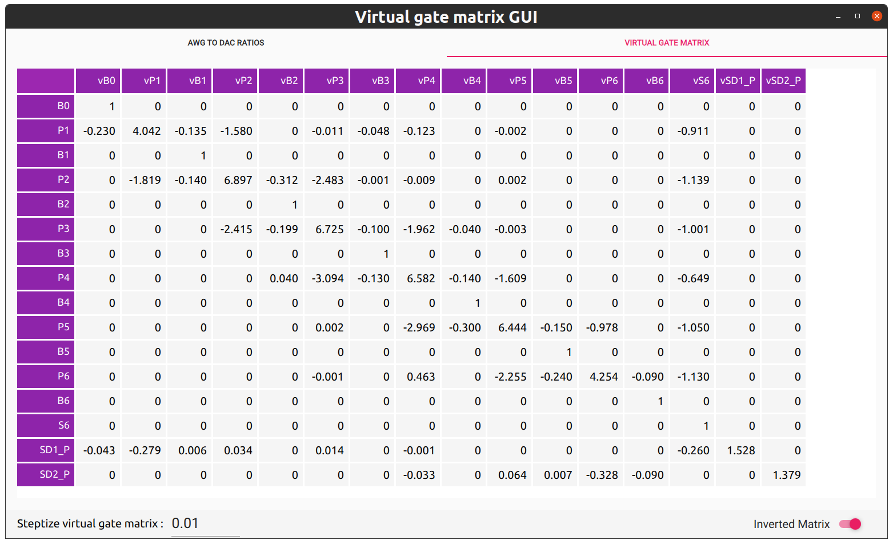
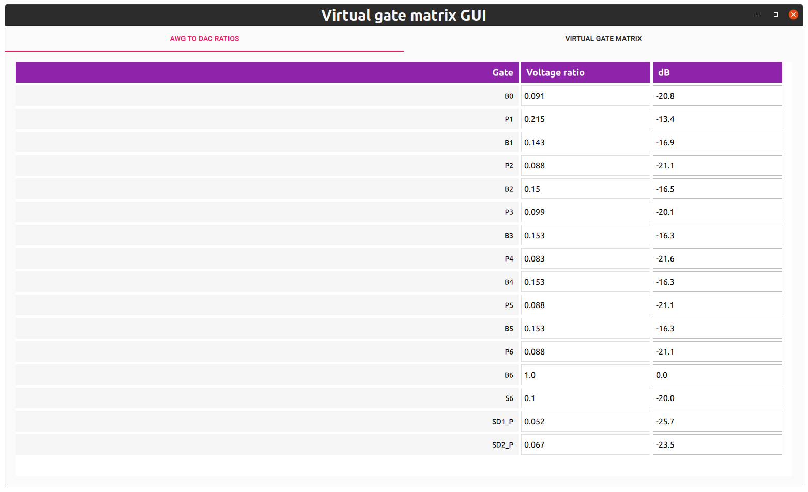

Using Virtual gates
===================

Manually
--------

In section a short example will be shown how to access manually parts of the virtual gate matrix.


The virtual gates present in the system can be present the system can be inspected by:
```python
from core_tools.drivers.hardware.hardware import hardware

hw = hardware()

print(hw.virtual_gates)
```
This returns if configured as in the previous section:
```
Found 1 virtual gate matrix :
	name :: test 	(size = 16x16)
```
The content of this virtual gate matrix can be accessed like
```python
v_mat = hw.virtual_gates.test

# altneratively you can also call by the order it appeared prev
# v_mat = hw.virtual_gates[0]

# printing the contents
print(v_mat)
```
Returning:
```
Virtual gate matrix named test
Contents:

Gates : ['B0', 'P1', 'B1', 'P2', 'B2', 'P3', 'B3', 'P4', 'B4', 'P5', 'B5', 'P6', 'B6', 'S6', 'SD1_P', 'SD2_P']
Virtual gates : ['vB0', 'vP1', 'vB1', 'vP2', 'vB2', 'vP3', 'vB3', 'vP4', 'vB4', 'vP5', 'vB5', 'vP6', 'vB6', 'vS6', 'vSD1_P', 'vSD2_P']
Matrix :
[1. 0. 0. 0. 0. 0. 0. 0. 0. 0. 0. 0. 0. 0. 0. 0.]
...
```
Elements can be accesed by using the following operators : 
```python
# set entry 0,1 to 0.1
v_mat[0,1] = 0.1

# replace the whole matrix :
v_mat.matrix = np.eye(len(v_mat.matrix))
```

Using a GUI
-----------

This is by far the easiest method for modifying the virtual gate matrix, the GUI can be opened by calling:
```python
from core_tools.GUI.virt_gate_matrix_qml.gui_controller import virt_gate_matrix_GUI
virt_gate_matrix_GUI()
```

The result should look something like:


In the AWG to DAC ratio tab, the AWG to dac ratio's can be set:
