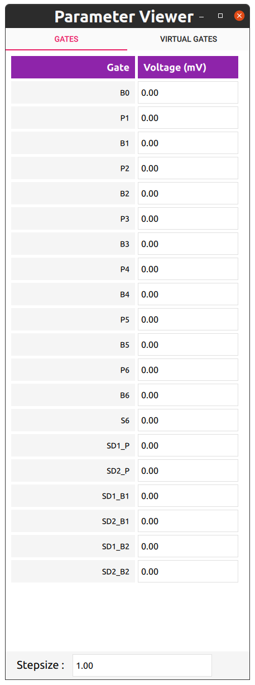

Hardware class and gates
========================

Setting up the hardware
-----------------------

The hardware class is a class that links the hardware together. These are DACs and AWGs to the electrode layout of a chip.

To set up the link between the electrode names and the DACs, a map like this can be made:
```python
from core_tools.drivers.hardware.hardware import hardware

hw = hardware()
hw.dac_gate_map = {
        'B0': (0, 1), 'P1': (0, 2), 
        'B1': (0, 3), 'P2': (0, 4),
        'B2': (0, 5), 'P3': (0, 6), 
        'B3': (0, 7), 'P4': (0, 8),

        'SD1_P': (1, 1), 'SD2_P': (1, 2), 
        'SD1_B1': (1, 3), 'SD2_B1': (1, 4),
        'SD1_B2': (1, 5), 'SD2_B2': (1, 6),}

hw.boundaries = {'B0' : (0, 2000), 'B1' : (0, 2500)}
```
In the dictionary, `hw.dac_gate_map`, every key represents an electrode name and every value is a tuple, formatted as `(dac module number, channel number)`. The boundaries, as defined in similar fashion with the following formatting `(min_voltage, max_voltage)` (in mV).


Virtual gates can by added by defining:
```python
hw.virtual_gates.add('virtual_gate_matrix',
	['P1', 'P2', 'P3', 'P4', 'B0', 'B1', 'B2', 'B3', 'SD1_P', 'SD2_P'])
hw.awg2dac_ratios.add(
	['P1', 'P2', 'P3', 'P4', 'B0', 'B1', 'B2', 'B3', 'SD1_P', 'SD2_P'])
```
When calling the add method of `hw.virtual_gates`, a virtual gate matrix is added. The first argument is the name of the matrix. The second argument is a list of gates to be used for the virtual gate matrix. The virtual matrix does not get effected when gates are added or removed. Values can be changed in python or using a GUI (see later).

The `awg2dac_ratios` argument can be used in combination with pulse_lib. This class is handy to take into account the attenuation of the coax cables in the fridge. When putting the ratio correctly, 1mV via the dacs should corresponds to 1mV with the AWG (this is handy for tuning).


Setting up gates
----------------

Once the hardware is set up, the gates object can be generated. An minimal example with virtual dacs would look as follows:

```python
# connect to the database to save your virtual gate matrices
from core_tools.data.SQL.connect import set_up_local_storage,
	set_up_remote_storage, set_up_local_and_remote_storage
set_up_local_storage('username', 'password', 'database_name',
						'project_name', 'set_up', 'sample_name')

from core_tools.drivers.hardware.hardware import hardware
from core_tools.drivers.virtual_dac import virtual_dac
from core_tools.drivers.gates import gates


import qcodes as qc

# generate the dacs
my_dac_1 = virtual_dac("dac_a", "virtual")
my_dac_2 = virtual_dac("dac_b", "virtual")

# add the hardware
hw =  hardware()
hw.dac_gate_map = {
    'B0': (0, 1), 'P1': (0, 2), 
    'B1': (0, 3), 'P2': (0, 4),
    'B2': (0, 5), 'P3': (0, 6), 
    'B3': (0, 7), 'P4': (0, 8), 
    'B4': (0, 9), 'P5': (0, 10),
    'B5': (0, 11),'P6': (0, 12),
    'B6': (0, 13), 'S6' : (0,14,),
    'SD1_P': (1, 1), 'SD2_P': (1, 2), 
    'SD1_B1': (1, 3), 'SD2_B1': (1, 4),
    'SD1_B2': (1, 5), 'SD2_B2': (1, 6),}
hw.boundaries = {'B0' : (0, 2000), 'B1' : (0, 2500)}
hw.virtual_gates.add('test', ['B0', 'P1', 'B1', 'P2', 'B2', 'P3', 'B3', 'P4', 'B4', 'P5', 'B5', 'P6', 'B6', 'S6', 'SD1_P', 'SD2_P'])
hw.awg2dac_ratios.add(hw.virtual_gates.test.gates)
    
my_gates = gates("gates", hw, [my_dac_1, my_dac_2])

station=qc.Station(my_dac_1, my_dac_2, my_gates, hw)
```

A GUI for the gates can be pulled up using the following code:
```python
from core_tools.GUI.parameter_viewer_qml.param_viewer import param_viewer

# if gates are not names gates, it needs to be provided as an argument.
ui = param_viewer(my_gates)
```


