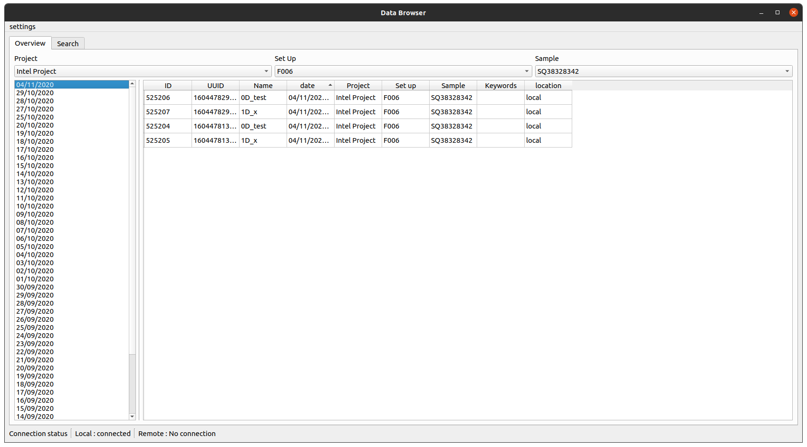
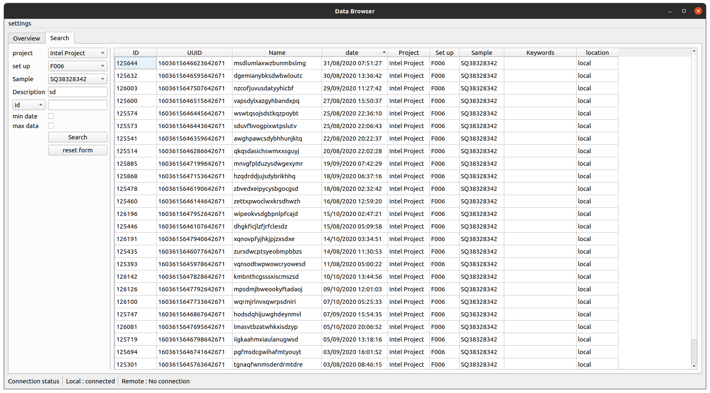
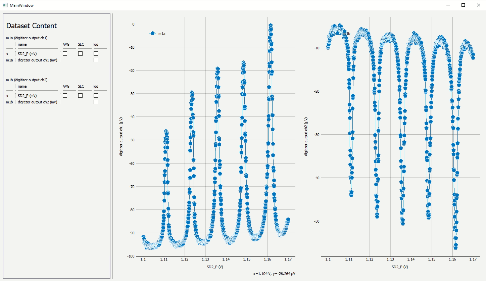
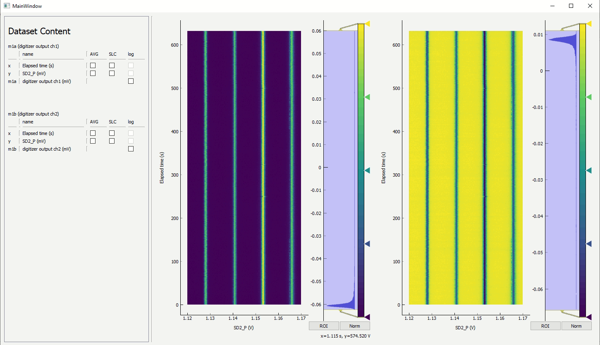

Starting up the GUI
===================

The dataset comes with two standard GUI's,
- The databrowser (inspired on PLOTTR from Kouwenhoven lab)
- Liveplotting utility (based on pyqtgraph)

DataBrowser
-----------

The databrowser displays the meaurements that have been executed by the user. It is recommened to run the databrowser in a seperate process (otherwise it will stop working during measurements).

A example file (browse_db.py) could look like:

```python
from core_tools.data.SQL.connector import set_up_local_storage
from core_tools.data.gui.data_browser import data_browser

set_up_local_storage("myusername", "mypasswd", "mydbname", "project_name", "set_up_name", "sample_name")
data_browser()
```

In the command prompt one could execute:
```bash
python /path_to_pythonfile/browse_db.py
```

The window that pops up should look like this:



(Live)Plotting
--------------
Liveplotting can be enabled in the settings tab of the databrowser.

Plots of dataset can be generated by:
```python
from core_tools.data.ds.data_set import load_by_uuid, load_by_id
from core_tools.data.gui.plot_mgr import data_plotter

ds = load_by_id(1)
plot = data_plotter(ds)
```

A example window would look like:

